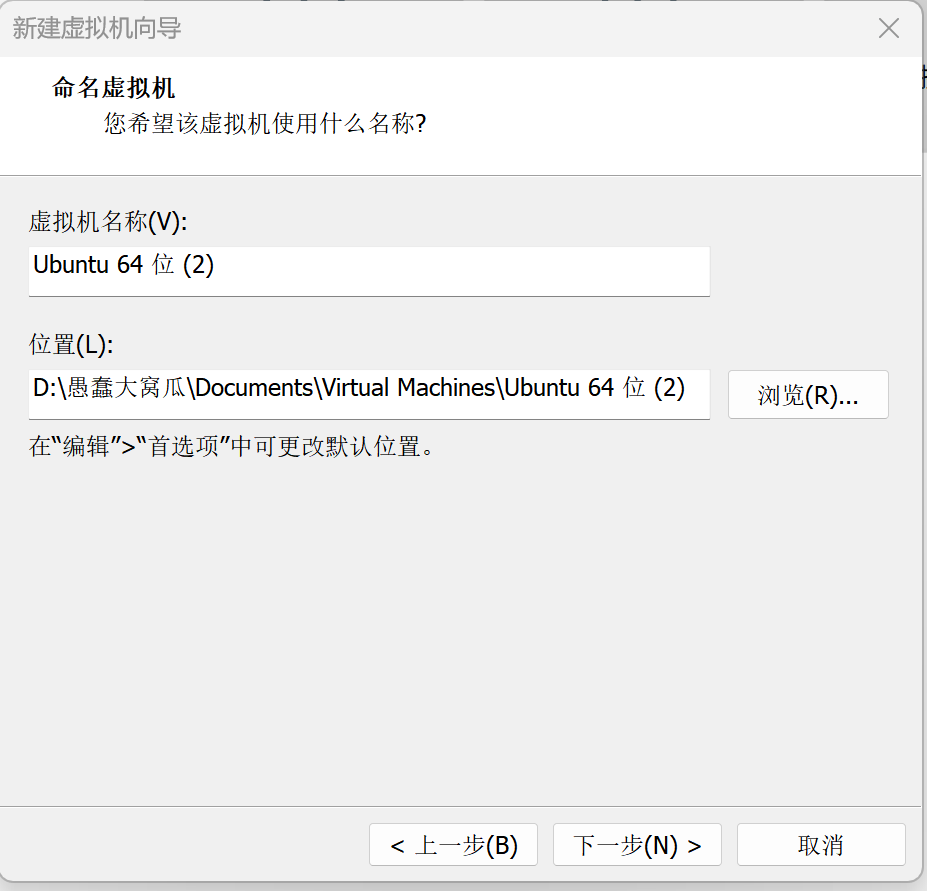
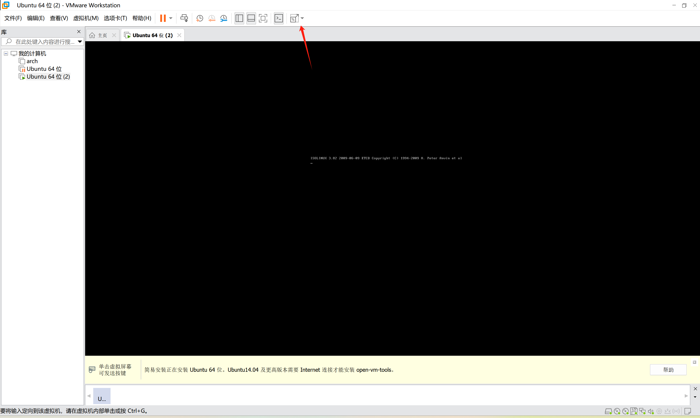
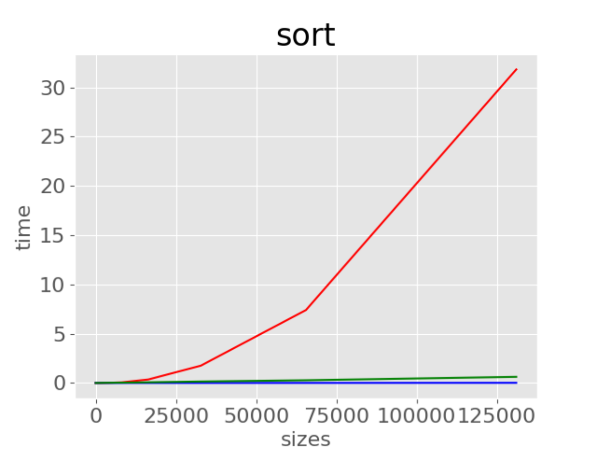
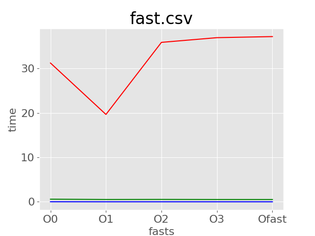

# NCUSCC选拔——C语言试题报告
>wrinting by FoolishPumpkin
**写在最上面：以下所有的fab都是斐波那契的简写（我是丈育）**
<hr>

## 一、安装Ubantu与配置环境
### 1.下载Ubantu镜像文件

由于在官网下载速度已经很快，目前暂且先不用镜像源
>小小的插一句嘴：似乎我在官网下载archlinux时速度也很快，不到两分钟就下完了，但还是有人建议用镜像源，此处留下疑问
### 2.在虚拟机中安装Ubantu
由于该任务对于性能要求不高，本部分采用vmware
#### （1）下载并安装VMware（略）
#### （2）在VMware上建立Ubantu虚拟机



#### （3）打开虚拟机，安装Ubantu

画面太小，先拉伸一下画面


此处没有中文，只能先选一下英文

然后一直下一步

Restart Now
#### （4）安装后，就可以取消与镜像的链接了

### 3.在Ubantu中配置C语言和环境
#### （1）安装C语言编译器
在命令行中执行以下命令：以管理员身份，检查更新，并安装C语言编译器（gcc）
```shell
sudo apt update
sudo apt install build-essential
```
#### （2）安装合适的文本编辑器
此处为图方便，我们就安装人民群众最喜闻乐见的编辑器——vscode
>注：Visual Studio Code 并不在 Ubuntu 的官方源中，可以直接通过Ubuntu自带软件商店来安装，但也可以去官网下载dab包再通过apt命令来安装。


#### 由于在VMware中安装完后无需其他调整便可以完成网络连接，此处就不再折磨自己了
## 二、完成C语言任务
### 1.冒泡排序
#### （1）原理解释
>冒泡排序（bubble sort）通过连续地比较与交换相邻元素实现排序。这个过程就像气泡从底部升到顶部一样，因此得名冒泡排序。


其核心要领在于：外层循环控制遍历次数，内层循环执行实际比较和交换，如果前一个元素大于后一个元素，则交换
#### （2）代码实现
```cpp
void bubbleSort(int nums[], int size) {
    for (int i = 0; i < size; i++) {
        for (int j = i+1; j < size; j++) {
            if (nums[j] > nums[j + 1]) {
                int temp = nums[j];
                nums[j] = nums[j + 1];
                nums[j + 1] = temp;
            }
        }
    }
}
```
### 2.基础堆排序
#### （1）原理解释
利用二叉堆的特性，通过对数组堆化来排序
#### （2）代码实现
```cpp
void siftDown(int *arr, int start, int end) {   
    int root = start;        
    while (root * 2 + 1 <= end) {
        int child = root * 2 + 1;     
        int swap = root;      // 存储最大值的位置    
        if (arr[swap] < arr[child]) {     
            swap = child;   // 记录左孩子的位置
        }
        if (child + 1 <= end && arr[swap] < arr[child + 1]) {      
            // 如果右孩子存在且大于根节点，记录右孩子的位置
            swap = child + 1;     
        }
        // 如果最大值不是根节点，交换根节点和最大值
        if (swap != root) {   
            int temp = arr[root];   
            arr[root] = arr[swap];  
            arr[swap] = temp;        
            root = swap;        
        } else {
            return;  
        }
    }
}
void heapsort(int *arr, int len) {
    int start = (len - 2) / 2;    // 最后一个非叶子节点
    while (start >= 0) {
        siftDown(arr, start, len - 1);   // 建立最大堆
        start--;    // 向前继续建立最大堆
    }
    int end = len - 1;    // 数组最后一个元素
    while (end > 0) {
        int temp = arr[0];   // 交换根节点和最后一个元素
        arr[0] = arr[end];   
        arr[end] = temp;      
        siftDown(arr, 0, end - 1);   // 重新建立最大堆
        end--;    // 继续建立最大堆
    }
}
```
### 3.斐波那契堆排序
>##### （1）原理解释
>斐波那契堆排序（Fibonacci Heap Sort）是一种基于斐波那契堆的数据结构的排序算法。斐波那契堆是一种优先队列数据结构，具有较好的摊还时间复杂度特性，特别适合用于需要频繁执行合并操作的应用场景。以下是斐波那契堆排序的基本概念和步骤：
>##### 基本概念
>1. **斐波那契堆**：一种由一组堆有序树（每个节点的键值不小于其父节点的键值）组成的数据结构。斐波那契堆支持高效的合并操作。
>2. **摊还时间复杂度**：斐波那契堆的许多操作（如插入、合并、减少键值等）具有较低的摊还时间复杂度，使其在某些应用中非常高效。
>##### 斐波那契堆排序步骤
>1. **构建斐波那契堆**：将待排序的所有元素插入到一个斐波那契堆中。
>2. **提取最小元素**：重复从斐波那契堆中提取最小元素，并将其放入已排序序列中，直到堆为空。
(以上内容均来自github copilot)

说两句牢骚话,斐波那契堆排序我个人感觉它更像是一种为了将各种复杂度降低而强凑出来的算法,其过于复杂的形式不仅丧失了数学的简洁美,也使其在实践中几乎无法使用
#### （2）代码实现
>注：由于本人过于废物，无法领会斐波那契堆的真谛，所以此处来源于"借鉴"(抄袭黄浩同学的成果)（就连通义千问与GitHub Copilot也无法完整实现）
（略）
## 三、测试与数据可视化
在这方面，python以其简洁的语法、丰富的功能在此方面远胜于C语言，本部分尽量使用python
### 1.编写测试数据生成脚本
```python
import random
def data(length,type='int'):
    ''''
    生成指定数量和类型的随机测试数据。
    :param length:指定生成数量
    :param type:指定生成类型
    '''
    if type=='int':
        return [random.randint(0,1000) for _ in range(length)]
    elif type=='float':
        return [random.uniform(0,1000) for _ in range(length)]
    else:
        raise ValueError("Unsupported data type. Use 'int' or 'float'.") 

for i in range(1,18):
    length=2**i
    print(f"length={length}")
    datas=data(length)
    with open(f'./data/data_{length}','w') as f:
        for item in datas:
            f.write("%s\n" % item)
#初版代码中采用的是10的乘方，但数据跨度过大，于是此处改为2的乘方，注意到2**17=131072>100000
```
### 2.在C语言中调用生成数据
#### （1）背景思路：
此处笔者本来想直接利用python去调用C语言代码进行测量，但是经过资料查询后发现难度过高，便采用折中方式，即利用python生成数据到一个文件中，再用C语言进行排序测量等操作，将返回的结果存到另一个文件中，再用python进行分析
#### （2）代码实现：
### 3.数据处理
```python
from pathlib import Path
import csv
import matplotlib.pyplot as plt
path=Path("./data_0.csv") 
lines=path.read_text().splitlines()  
reader=csv.reader(lines)
head=next(reader)   
bubble_times=[]
heap_times=[]
fab_times=[]
sizes=[]
for row in reader:
    size=int(row[0])
    bubble_time=float(row[1])
    heap_time=float(row[2])
    fab_time=float(row[3])
    sizes.append(size)
    bubble_times.append(bubble_time)
    heap_times.append(heap_time)
    fab_times.append(fab_time)
plt.style.use('ggplot')
fig, ax = plt.subplots()
ax.plot(sizes,bubble_times, color='red')
ax.plot(sizes,heap_times, color='blue')
ax.plot(sizes,fab_times, color='green')
ax.set_title("sort", fontsize=24)
ax.set_xlabel("sizes", fontsize=16)
ax.set_ylabel("time", fontsize=16)
ax.tick_params(labelsize=16)
ax.tick_params(labelsize=16)
plt.savefig("./data")
#改编自《python编程：从入门到实践 第3版》P408
#此外，在linux上plt.show似乎不能正常运行
#不同优化选项的处理方式类似
```
>**为什么没用with open?**
**GitHub Copilot:**
这段代码没有使用 with open 的原因可能是因为 Path 对象提供了更简洁的文件读取方法 read_text()，不需要显式地打开和关闭文件。
不过，使用 with open 语句可以更好地管理文件资源，确保文件在使用后被正确关闭。
## 四、实验数据分析
### 1.实验预期
#### （1）时间复杂度分析
**冒泡排序：** 两次循环，时间复杂度为O(n²)
**堆排序** 与 **斐波那契堆排序** 时间复杂度均为(nlogn),在数学上，x恒大于log(x)，因此冒泡排序速度会很慢
#### （2）四种优化
**O0:** 无优化。编译器生成的代码与源代码最接近，调试信息最完整，但运行速度最慢。
**O1:** 基本优化。编译器进行一些基本的优化，如消除冗余代码和简单的循环优化。运行速度有所提升，但优化程度有限。
**O2:** 更高的优化。编译器进行更多的优化，如更复杂的循环优化、内联函数等。运行速度显著提升。
**O3:** 最高级别的优化。编译器进行所有可能的优化，包括自动向量化、函数内联、循环展开等。运行速度最快，但编译时间较长，生成的二进制文件可能更大。
**Ofast:** 激进优化。启用 O3 级别的优化，并进行一些可能违反标准的优化，如忽略严格的浮点运算规则。运行速度最快，但可能会导致一些不符合标准的行为。
从理论上，运行速度：Ofast>O3>O2>O1>O0
### 2.实验结果
#### (1)横向比较，三种排序方式的时间花费（red:bubble；green:fab；blue:heap）
控制优化选项均为O0

可以看见冒泡排序所用时间远远大于两种堆排序，且数据量越大越明显，而两种堆排序速度几乎相同，但斐波那契堆排序速度略慢一点
**分析**  冒泡排序时间复杂度为O(n²)大于两种堆排序时间复杂度O(nlogn)，且由于斐波那契堆的实现相较于基础堆排序更复杂，所以在调用上速度会略慢，符合实验预期。
>**乌龙：** 当时凌晨弄完时不小心将bubblesort和heapsort数据弄反造成疑惑
#### (2)纵向比较，四种优化选项的时间花费
控制排序数据量均为131072（最大数据）
>由于本人无法在外部编写一个脚本将代码分别以四个优化程度运行并将数据导入一个csv文件中，故本部分所有数据均为手动


**分析** 难以理解，不可置信
## 五、实验中遇到的问题
### 1.选择哪个试题
事实上，相比c语言，我更喜欢某蟒蛇语言，但可惜电脑性能不够，个人感觉拿战术显卡搞矩阵或者pytorch显然不太合适
### 2.冒泡排序为什么不能单层循环
这个项目里曾编写过一个data_assert.py（已废弃，如下）用于检验排序后数据是否正确，但由于再将排序后数据输出保存到另一个文件过于麻烦，因此废弃,但是
```python
with open("./data/data_500",'r') as f:
    test_data = [int(line.strip()) for line in f]
    for i in range(1, len(test_data)):
        if test_data[i-1] <= test_data[i]:
            raise ValueError(f"List is not strictly decreasing at index {i-1} and {i}")
#本代码本来使用类似冒泡排序的逻辑检查
# 但在github copilot的建议下，改用此方法
```
可以看见，在这里，copilot帮我做了一个小改动，那么我们不禁思考，为什么排序不能用这种单层循环？答案是显然的，单层循环只能让数据浮上来一个格子，不能保证排序的完全。而此处目的是检验，故只需一次即可。
### 3.C语言怎么打开文件
>在C语言中，处理文件的函数主要包含在标准输入输出库（stdio.h）中。以下是一些常用的文件操作函数及其解释：
**fopen：**
用于打开文件。
原型：FILE *fopen(const char *filename, const char *mode);
参数：
filename：要打开的文件名。
mode：文件打开模式，如 "r"（只读），"w"（写入），"a"（追加），"r+"（读写），等。
返回值：成功时返回文件指针，失败时返回 NULL。
**fclose：**
用于关闭文件。
原型：int fclose(FILE *stream);
参数：stream 是要关闭的文件指针。
返回值：成功时返回 0，失败时返回 EOF。
**fscanf：**
从文件中读取格式化输入。
原型：int fscanf(FILE *stream, const char *format, ...);
参数：
stream：文件指针。
format：格式字符串，类似于 scanf。
...：指向存储读取数据的变量的指针。
返回值：成功读取的项数，遇到文件结束或读取错误时返回 EOF。
**fprintf：**
向文件中写入格式化输出。
原型：int fprintf(FILE *stream, const char *format, ...);
参数：
stream：文件指针。
format：格式字符串，类似于 printf。
...：要写入的数据。
返回值：成功写入的字符数，失败时返回负值。
**fread：**
从文件中读取数据块。
原型：size_t fread(void *ptr, size_t size, size_t nmemb, FILE *stream);
参数：
ptr：指向存储读取数据的缓冲区。
size：每个数据块的大小。
nmemb：要读取的数据块数量。
stream：文件指针。
返回值：成功读取的数据块数量。
**fwrite：**
向文件中写入数据块。
原型：size_t fwrite(const void *ptr, size_t size, size_t nmemb, FILE *stream);
参数：
ptr：指向要写入的数据的缓冲区。
size：每个数据块的大小。
nmemb：要写入的数据块数量。
stream：文件指针。
返回值：成功写入的数据块数量。
**fseek：**
设置文件指针的位置。
原型：int fseek(FILE *stream, long offset, int whence);
参数：
stream：文件指针。
offset：相对于 whence 的偏移量。
whence：位置基准，可以是 SEEK_SET（文件开头），SEEK_CUR（当前位置），或 SEEK_END（文件末尾）。
返回值：成功时返回 0，失败时返回非零值。
**ftell：**
获取文件指针的当前位置。
原型：long ftell(FILE *stream);
参数：stream 是文件指针。
返回值：文件指针的当前位置，失败时返回 -1L。
这些函数提供了基本的文件操作功能，可以用于读取、写入、定位和关闭文件。
### 4.指针的一点问题
#### （1）使用指向字符的指针表示字符串**
你也可以使用指向字符的指针来表示字符串。这通常通过字符串字面量来实现，字符串字面量实际上是一个指向字符数组首元素的指针，该数组以空字符结尾。例如：
```cpp
const char *str = "Hello, World!";
```
在这个例子中，str 是一个指向字符的指针，它指向包含字符串 "Hello, World!" 的字符数组。
**注意事项**
字符串字面量是不可修改的，因此它们实际上是 const char 类型的指针。尝试修改通过字符串字面量创建的指针所指向的内容会导致编译错误。
如果你需要一个可修改的字符串，你应该使用字符数组，并确保数组的最后一个元素是空字符。
字符串字面量是一种特殊的数据表示方式，用于表示文本字符串。字符串字面量是由双引号 " 包围的一系列字符，例如 "Hello, World!"。当你在代码中写下一个字符串字面量时，编译器会为它分配一块内存，并将这块内存中的字符初始化为字符串字面量中的字符，最后在字符串的末尾添加一个空字符（'\0'），这个空字符标志着字符串的结束。
**特点**
不可修改：字符串字面量存储在程序的只读数据段中，这意味着你不能修改字符串字面量中的字符。尝试修改字符串字面量中的字符会导致编译错误。
以空字符结尾：字符串字面量会自动在末尾添加一个空字符（'\0'），这个空字符是 C 语言中字符串结束的标志。
**类型：** 字符串字面量在 C 语言中被当作 const char 类型的数组，或者更准确地说，是指向这个数组首元素的指针。
**字符串字面量与字符数组的区别**
字符串字面量：是不可修改的，存储在只读内存区域，通常用于初始化指向 const char 类型数组的指针。
字符数组：是可以修改的，存储在可写的内存区域，通常用于存储需要修改的字符串。
#### （2）int nums[]与int *arr
在 C 语言中，函数传参时使用数组和指针有相似之处，也有区别。下面我会详细解释 int nums[] 和 int *arr 在函数传参中的区别与联系。

**联系**
都是数组的表示：int nums[] 和 int *arr 在函数参数中都可以用来表示数组。它们都可以接受数组类型的数据，并在函数内部进行操作。

都退化为指针：在函数参数中，数组名会自动退化为指向数组首元素的指针。因此，int nums[] 和 int *arr 在函数内部实际上是等价的。

**区别**
**语法上的不同：**
int nums[] 明确表示这是一个数组。
int *arr 表示这是一个指针，可以指向任意位置的整数。
**语义上的不同：**
int nums[] 强调的是数组的概念，它暗示了数组的连续存储和固定大小。
int *arr 强调的是指针的概念，它更加灵活，可以指向任意位置，不一定连续，也不一定是数组的一部分。
**大小限制：**
int nums[] 在函数参数中不能指定数组的大小，它依赖于实际传入的数组大小。
int *arr 可以与 sizeof 运算符一起使用来获取数组的大小，但需要额外的参数来指定数组的大小。
**函数定义：**
当使用 int nums[] 作为参数时，函数只能接受数组类型的参数。
当使用 int *arr 作为参数时，函数可以接受数组类型的参数，也可以接受单个整数的指针。
**可修改性：**
int nums[] 和 int *arr 在函数内部都是可修改的，因为它们都是通过引用传递的。
#### （3）内存
计算机内存是一个临时存储区域，用于存放正在运行的程序的数据和指令。内存可以分为几个不同的部分：

栈（Stack）：用于存储局部变量和函数调用时的信息。栈内存是自动管理的，当函数调用结束时，栈上的数据会被自动释放。
堆（Heap）：用于动态分配的内存。程序员可以通过 malloc, calloc, realloc 和 free 等函数来手动管理堆内存。
静态/全局区（Static/Global Area）：用于存储全局变量和静态变量。这些变量在程序的整个生命周期内都存在。
代码段（Code Segment）：存储程序的实际机器代码。
### 4.C语言中内存的动态分配 
**1. malloc**
功能：分配指定字节数的内存块。
原型：void* malloc(size_t size);
参数：size：要分配的内存字节数。
返回值：成功时返回指向分配内存的指针；如果分配失败，则返回 NULL。
```C
#include <stdlib.h>int main() {
    int *ptr;    int n = 5;    // 分配足够的空间来存放 n 个整数
    ptr = (int*) malloc(n * sizeof(int));
    if (ptr == NULL) {
        fprintf(stderr, "Memory allocation failed\n");
        return 1;
        }
    // 使用分配的内存
    for (int i = 0; i < n; i++) {
        ptr[i] = i * 10;
        }
    // 打印结果
    for (int i = 0; i < n; i++) {
        printf("%d ", ptr[i]);
        }
    printf("\n");
    // 释放内存
    free(ptr);
    return 0;}
```
**2. calloc**
功能：分配指定数量和大小的对象，并初始化为零。
原型：void* calloc(size_t num, size_t size);
参数：num：对象的数量。
size：每个对象的大小（以字节为单位）。
返回值：
成功时返回指向分配内存的指针。如果分配失败，则返回 NULL。
```c
#include <stdlib.h>int main() {
    int *ptr;    int n = 5;    // 分配并初始化为零的空间
    ptr = (int*) calloc(n, sizeof(int));
    if (ptr == NULL) {
        fprintf(stderr, "Memory allocation failed\n");
        return 1;
        }
    // 使用分配的内存
    for (int i = 0; i < n; i++) {
        ptr[i] = i * 10;
        }
    // 打印结果
    for (int i = 0; i < n; i++) {
        printf("%d ", ptr[i]);
        }
    printf("\n");
    // 释放内存
    free(ptr);
    return 0;}
```
**3. realloc**
功能：重新分配内存块的大小。
原型：void* realloc(void* ptr, size_t new_size);
参数：
ptr：指向先前分配的内存块的指针。
new_size：新的内存块大小（以字节为单位）。
返回值：
成功时返回指向新分配内存的指针（可能是原地址，也可能是新地址）。如果分配失败，则返回 NULL，并且原内存块保持不变。
```C
#include <stdlib.h>int main() {    
    int *ptr;    int n = 5;    // 初始分配    
    ptr = (int*) malloc(n * sizeof(int));    
    if (ptr == NULL) {
        fprintf(stderr, "Memory allocation failed\n");
        return 1;
        }
    // 使用初始分配的内存
    for (int i = 0; i < n; i++) {
        ptr[i] = i * 10;
        }
    // 重新分配更大的内存
    n = 10;
    ptr = (int*) realloc(ptr, n * sizeof(int));
    if (ptr == NULL) {
        fprintf(stderr, "Memory reallocation failed\n");
        return 1;
        }
    // 使用新分配的内存
    for (int i = 5; i < n; i++) {
        ptr[i] = i * 10;
        }
    // 打印结果
    for (int i = 0; i < n; i++) {
        printf("%d ", ptr[i]);
        }
    printf("\n");
    // 释放内存
    free(ptr);    return 0;}
```
**4. free**
功能：释放之前通过 malloc, calloc 或 realloc 分配的内存。
原型：void free(void* ptr);
参数：ptr：指向要释放内存的指针。如果 ptr 是 NULL，则函数不执行任何操作。
返回值：无。
// 示例中的 free 调用已经在上面的示例代码中展示了
**注意事项**
(1)检查分配是否成功：始终检查 malloc, calloc 和 realloc 的返回值是否为 NULL，以确保内存分配成功。
(2)避免重复释放：不要多次释放同一个内存块，这会导致未定义行为。
(3)使用后释放：确保所有动态分配的内存最终都被释放，以避免内存泄漏。
(4)避免悬空指针：在释放内存后，将指针设置为 NULL，以防止悬空指针。
通过以上介绍，你应该对C语言中的动态内存分配有了一个基本的理解。如果你有更具体的问题或者需要进一步的例子，请告诉我！

>#### 特别鸣谢：GitHub Copilot、通义千问对我这次任务无微不至的关怀,此外感觉kimi就是一个披着AI的皮的搜索引擎
>#### 参考书籍及网站
>1.《python编程：从入门到实践》
2.《明解C语言》
3.[《hello 算法》](https://www.hello-algo.com/chapter_hello_algo/)
4.斐波那契堆（B站也有中文机翻版）：https://www.bilibili.com/video/BV1x54y1w7Y6/?spm_id_from=333.999.0.0&vd_source=64e9a501caee9f41a00f02aea80766e6
5.markdown学习：https://blog.csdn.net/qq_40818172/article/details/126260661?sharetype=blog&shareId=126260661&sharerefer=APP&sharesource=foolishpumpkin&sharefrom=link
6.最后，感谢黄浩同学的斐波那契堆代码：https://github.com/HowXu